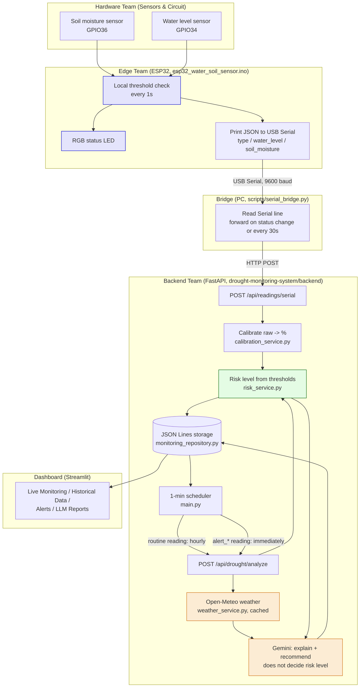

## Notes

- The Edge device (ESP32) never calls any API directly -- it only prints
  JSON over USB Serial. `serial_bridge.py`, running on a PC, is the only
  thing that talks HTTP to the Backend. See
  [environment-setup.md](environment-setup.md) for why (Wi-Fi was tried
  and dropped -- see [implementation-rules-wifi.md](implementation-rules-wifi.md)).
- `POST /api/readings/serial` is cheap and runs on every reading (it only
  calibrates and stores); `POST /api/drought/analyze` is the expensive
  call (weather + Gemini) and is throttled by the Backend's scheduler,
  not the Edge device.
- Gemini only explains and recommends in plain English -- the
  deterministic risk score/level (`risk_service.py`, driven by the
  `SOIL_*_THRESHOLD` / `WATER_*_THRESHOLD` values in `.env`) is what
  actually decides anomaly vs. normal.
- There is no App/LINE/Discord notification yet -- the Streamlit
  dashboard is the current way to see alerts and reports.
